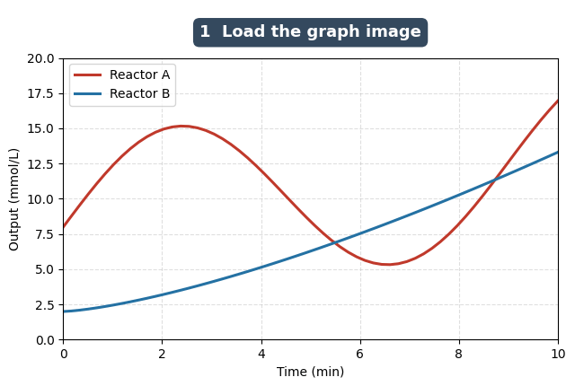
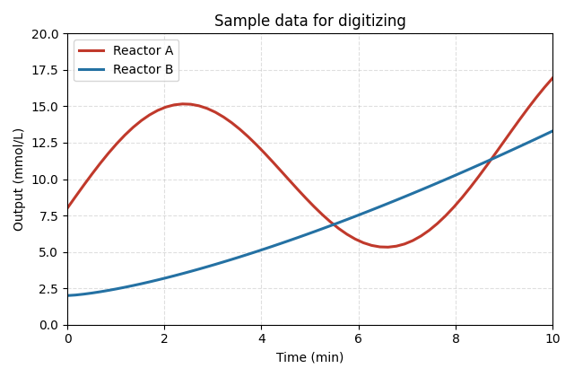

# Graph Digitizer

A client-side web app that turns a graph image into data. Load a screenshot or photo of a plot, calibrate the axes, extract the points from the curve (by hand or automatically by colour), and export a clean CSV. Everything runs in the browser, so there is no server, no upload, and no dependency to install. That also makes it trivial to host for free on GitHub Pages.

## What it does

- Loads an image by file picker, drag and drop, or clipboard paste.
- Calibrates the X and Y axes from two reference points each, with optional log scale on either axis.
- Adds data points manually by clicking, with a magnifier loupe for pixel-level precision.
- Extracts a curve automatically by sampling a colour you pick, restricted to the calibrated region.
- Handles multiple series on one plot, each with its own colour and label.
- Extracts single-colour and all-black plots. The auto tracer follows the curve by continuity and thickness, so it stays on the line through gridlines, axes, and text instead of averaging them together.
- Calibrates from either four reference points or, with the corner toggle, two opposite corners of the plot area.
- Exports to CSV in wide format (X,Y columns per series) or long format (series,x,y), and can copy straight to the clipboard.

## Try it in 60 seconds

A ready-made chart lives at `examples/sample-graph.png`. Load it and reproduce the numbers below.

1. Load `examples/sample-graph.png`.
2. Calibrate. Click "Set X1", click the origin on the image, type `0`. "Set X2", click where the x-axis reads 10, type `10`. "Set Y1" at `0`, "Set Y2" at `20`.
3. Open "Automatic extraction", click "Pick colour", click on the red curve, then "Run auto extract". Repeat with a second series on the blue curve.
4. Download CSV.

## Using your own graphs

1. Load a graph image.
2. Calibrate. Four-point mode: click a "Set" button, click that point on the axis, type its real value; repeat for all four. Or tick "2-point corner mode" and click the bottom-left and top-right corners of the plot area, then enter the min/max values. Tick log X / log Y if an axis is logarithmic.
3. Pick or add a series in the series panel.
4. Extract points. In "Add" mode, click along the curve. For a single clean line, use "Automatic extraction" as above.
5. Download CSV.

The cursor readout at the top right shows live data coordinates once calibration is complete, so you can verify the mapping before extracting.

## Accuracy note

The pixel-to-data mapping assumes the axes are horizontal and vertical, which holds for essentially all screenshots and rendered charts. If you feed it a photo taken at an angle, straighten/crop it first for best results. Calibration is most accurate when the reference points are far apart, so the two-corner mode works best on a full-size plot.

Automatic extraction assumes the curve is drawn at least as thick as any gridlines sharing its colour; that is how it tells them apart. If your gridlines are heavier than the curve, or two same-coloured curves overlap, place those points by hand. Tested on all-black plots (black curve, black gridlines, black axes) to a mean error under 0.2% of the y-range.

## Hosting on GitHub Pages

Two ways, pick one.

Simple (no workflow needed):

1. Create a repository and push these files to the default branch.
2. In the repo, go to Settings, then Pages.
3. Under "Build and deployment", set Source to "Deploy from a branch", pick your branch and the `/ (root)` folder, and Save.
4. Wait a minute; your app is live at `https://<username>.github.io/<repo>/`.

Automated (included workflow):

This repo ships with `.github/workflows/pages.yml`, which deploys the site on every push to `main`. To use it, in Settings, then Pages, set Source to "GitHub Actions". Push to `main` and the Actions tab will show the deploy.

## Running locally

Open `index.html` directly in a browser, or serve the folder:

    python3 -m http.server 8000

then visit `http://localhost:8000`.

## Files

- `index.html` - markup and layout
- `styles.css` - styling
- `app.js` - all digitizer logic (no libraries)
- `examples/sample-graph.png` - a colour chart to practice on
- `examples/black-graph.png` - an all-black chart to test monochrome extraction
- `docs/walkthrough.gif` - the four-step demo above
- `.github/workflows/pages.yml` - optional Pages deploy workflow

## License

MIT. See `LICENSE`.
